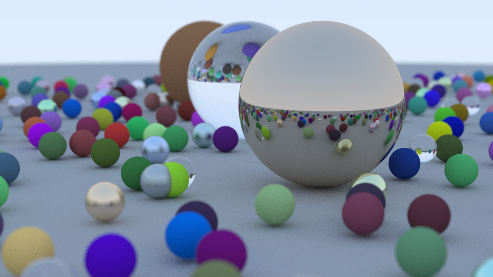
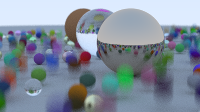
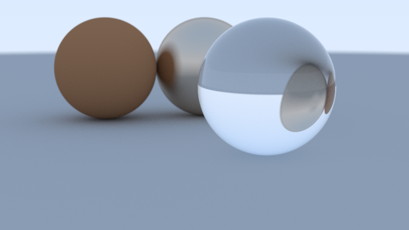
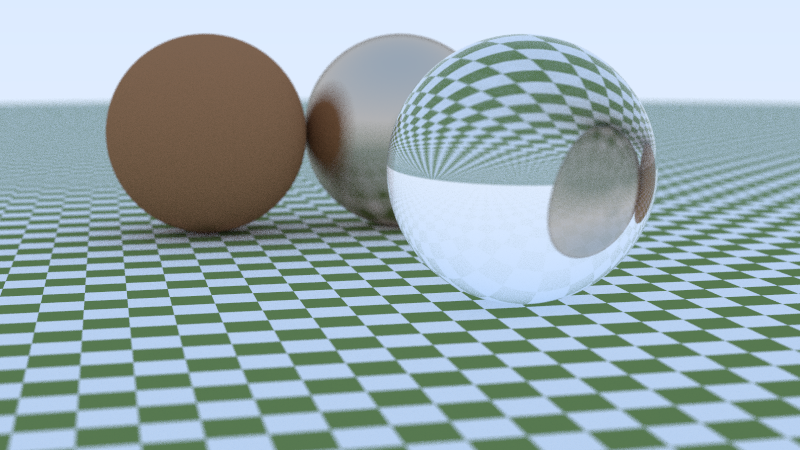
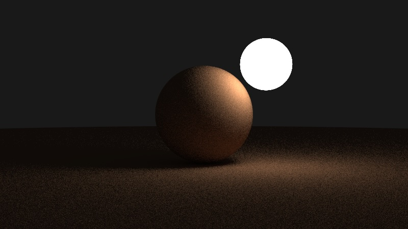
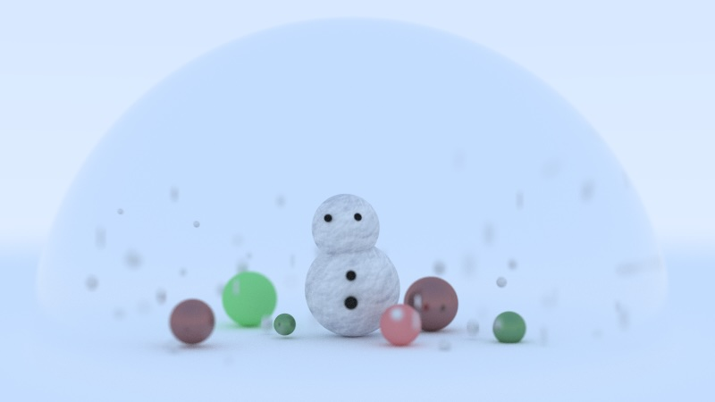
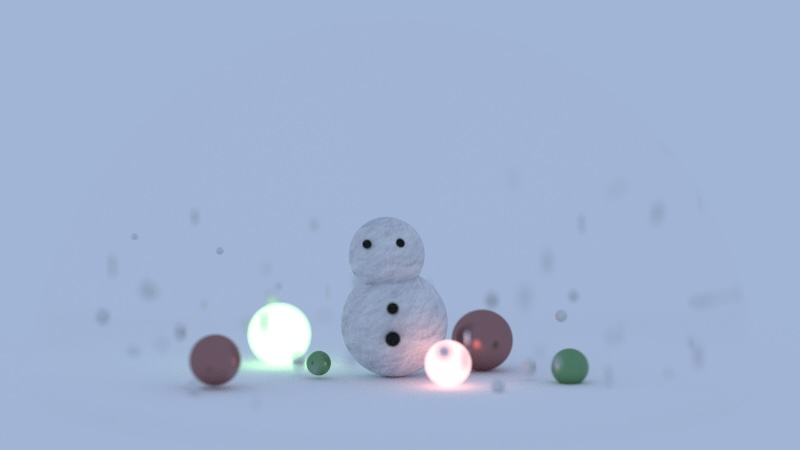

# Ratryace Engine
This is a raytrace engine built as a part of COS355(Computer Graphics, Dr.Denning) course work with a guidance from [Raytrace in One Weekend](https://raytracing.github.io)

## Rendering Outputs

### Motion Blur

### Blurry Reflections / Refractions

### Texture Mapping

### Light Emitting Sphere

### Creative Artifact

  
I made a snow globe with a snowman surrounded by some snow and small balls, all inside a big glass sphere.
Some balls have metal texture while others are simply diffused. 
I added a snow texture to the snowman and snow, and used motion blur to make it look like the snow was falling.
